# Create a Real-time Email Notification Feed With Customized Filters For Your Entire Domain

### Get notified only about the emails you care about.

In this tutorial we will create a Stream Feed ([grab a free trial here](https://getstream.io/activity-feeds/)) that will show live, filtered notifications for emails on a domain.


Perhaps your school district wants to monitor any emails containing threatening language on your domain, or your marketing team wants a live feed of social media email notifications that are siloed across several email addresses. You can use this app as a template, then easily customize which emails and notifications you are concerned about.

**This post will show you how to:**

- Create a SendGrid Inbound Parse Webhook that monitors your domain for incoming emails.
- Create an Express JS backend that receives the webhook and selectively filters posts to create notifications
- Build a frontend Stream Notification Feed that dynamically renders notifications with live updates.

Download the [Git Repository here](https://github.com/isaidspaghetti/stream-email-notifications) to follow along.

## 🧩 Outline

**SendGrid and Domain Setup**

- Open a free SendGrid trial account
- Authenticate your domain name with SendGrid
- Add a new MX DNS record on your domain
- Create SendGrid Inbound Parse

**Notifications App Setup**

- Configure Stream account
- User login
- Register Stream users
- Render a Stream feed
- Receive and filter SendGrid webhook
- Add notification activities to a Stream feed
- Add activities in real-time to a Stream Notification Feed

### Prerequisites

Everything we do in this app can be done with free trial accounts. The only thing you need to have set up is a domain name where you can create some DNS rules. (We'll show you how using [name.com](https://www.name.com/).) You can use whatever service you like--we won't be doing anything too fancy.

We will write the app using [React Hooks](https://reactjs.org/docs/hooks-intro.html) and [Express JS](https://expressjs.com/), so elementary knowledge of these will help. The techniques will translate easily to any other language or framework. See Stream's other libraries [here](https://getstream.io/docs/?language=js).

With that, let's get started by setting up SendGrid!

## 📊 SendGrid

### Account Sign-up

First thing's first: set up a [free SendGrid account](https://signup.sendgrid.com/).

### SendGrid Domain Authentication

Next, we'll authenticate your domain with SendGrid.

1. From your [SendGrid Dashboard](https://app.sendgrid.com/), in the left pane, select 'Settings' and ['Sender Authentication](https://app.sendgrid.com/settings/sender_auth).

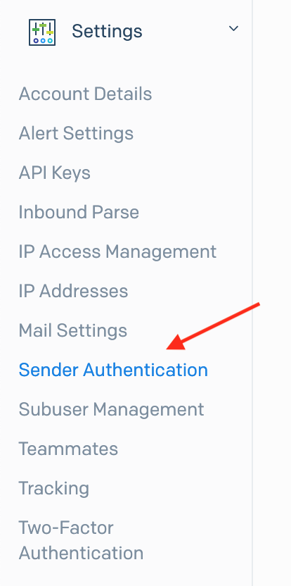

2. Select 'Authenticate Domain'.

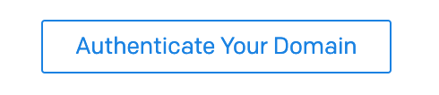

3. Enter your DNS host (eg: godaddy.com, name.com) and select 'no' on link branding.

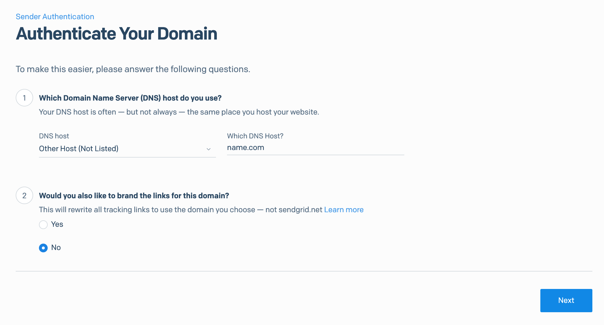

4. Enter your 'domain name', (eg: google.com, goodjobtaylor.com). Select 'Use Automated Security' in the advanced settings.

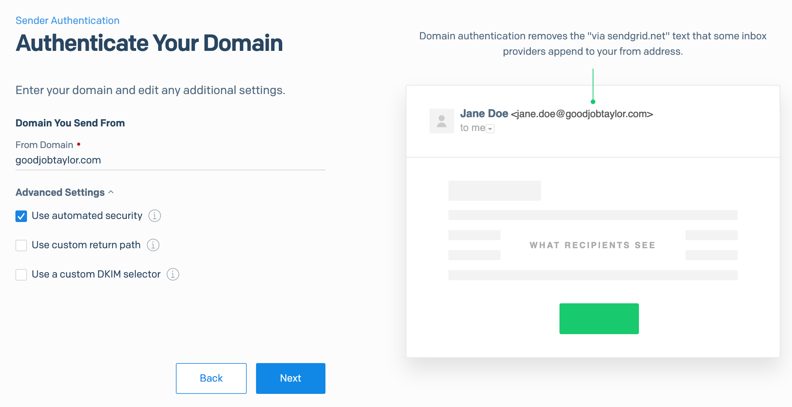

> **Note:** We'll be using the domain name 'goodjobtaylor.com'. Whenever you see that domain name in our examples, replace it with your domain name instead.

5. The next page shows the DNS records you need to add using your DNS host. Here's how to do it using 'name.com':

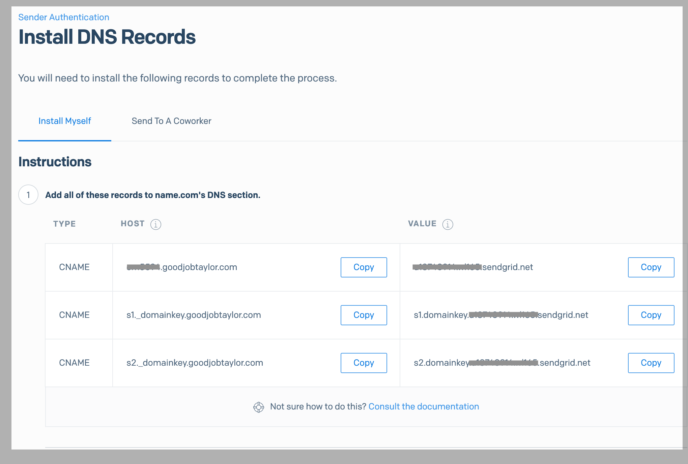

- In your DNS dashboard, select your domain and find where you can [view/edit/manage DNS records](https://www.name.com/account/domain/details/goodjobtaylor.com#dns).

- Copy and paste the DNS data from SendGrid and enter it as the details for your new DNS records. Make sure the record types are all 'CNAME'.

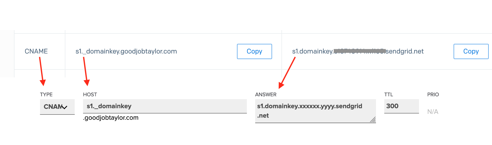

> **Hint**: In the 'host' input box, name.com fills my domain name in for me after 's1_domainkey'. For other hosts, you might have to enter your domain name after the address manually, eg: 's1.domainkey.goodjobtaylor.com'.

6. Once you've added all three records, click the 'Verify' button in SendGrid.

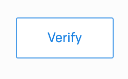

[Check here](https://sendgrid.com/docs/ui/account-and-settings/troubleshooting-sender-authentication/) for more help with these steps.

Great, now let's set up a DNS host with an MX record, needed for the Inbound Parse Webhook.

## Add DNS MX Record

> **Refresher:** An MX Record (Mail Exchange) specifies the mail server responsible for accepting email messages on behalf of a domain name.

1. In your host's DNS dashboard add a new DNS record of the 'MX' type.

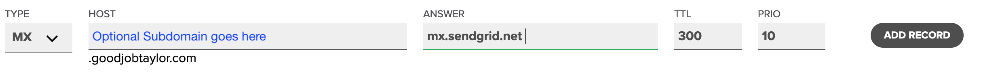

- The 'Host' name should be '.your-domain-name.whatever', eg: 'goodjobtaylor.com'.
- You can add an optional 'subdomain like '*parse*.goodjobtaylor.com'. We won't use a subdomain in this tutorial, so leave those fields blank. If you do use a subdomain, just be sure to use it throughout your setup.
- The 'Answer' must be 'mx.sendgrid.net'.
- Use 'TTL' of '300' and priority of '10'. If you don't have an input field for the priority, make your 'Answer' = '10 mx.sendgrid.net'.

  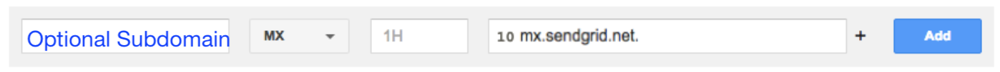

Awesome, now let's set up the Inbound Parse in SendGrid.

## SendGrid Inbound Parse Webhook Setup

1. Navigate to the 'Inbound Parse' setup page using the left pane of your SendGrid Dashboard.

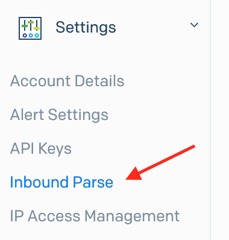

2. Click the 'Add Host & URL' Button.

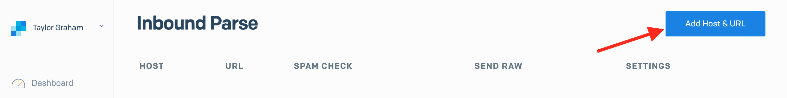

3. Enter your domain name for the 'Domain Name'. You can use a subdomain name here, but make sure it matches what you used in your MX records.
   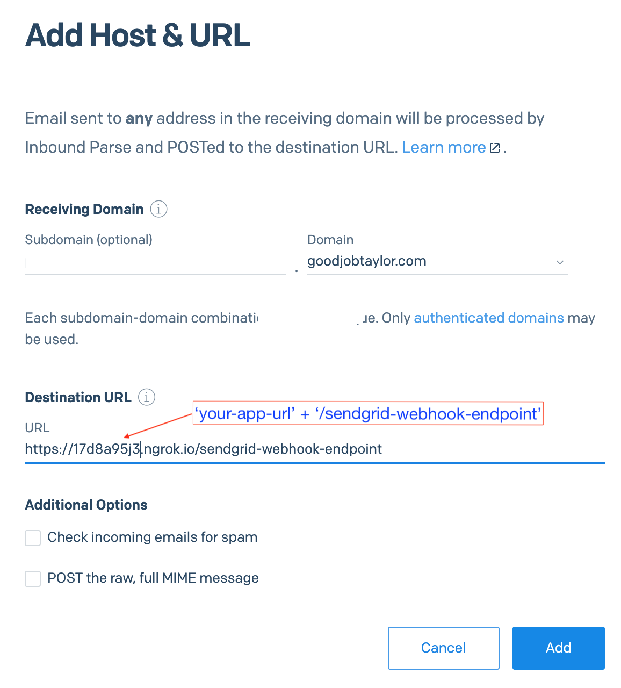

- The 'Destination URL' is where SendGrid's webhook will be `POST`ed. It should be a publically reachable URL where your backend is hosted + the endpoint path for the webhook. We'll name our app's endpoint `/sendgrid-webhook-endpoint`, so add that to the end of your URL ('goodjobtaylor.com/sendgrid-webhook-endpoint').

  > We like using 'ngrok' for a temporary development host. They use a secure tunnel to host your local port at a random, public URL. It's free and easy to use -- [sign up for ngrok here](https://ngrok.com/). Check out [this post](https://getstream.io/blog/how-to-capture-leads-from-live-chat-in-hubspot/) to learn how to set it up.

- (Optional) Check 'Spam Check' if you want Inbound Parse to check incoming email for spam. Checking this box will also include the spam report and spam score in the payload.

### Excellent!

At this point, your SendGrid and domain should be set up correctly. If you're monitoring your incoming requests via 'ngrok' console, you should see a `POST` to `/sendgrid-webhook-endpoint` in your monitoring console when you send an email to 'anyaddress@your-domain-name'.

Let's move on to your app setup by signing up for a Stream account.

## Stream Account Setup

1. First thing's first: sign up for your [free Stream Trial](https://getstream.io/). Check [here](https://getstream.io/blog/how-to-capture-leads-from-live-chat-in-hubspot) for help with this.

2. Once logged in to Stream, navigate to your [Stream Dashboard](https://getstream.io/dashboard).

3. Click the 'Create App' button in the upper right.

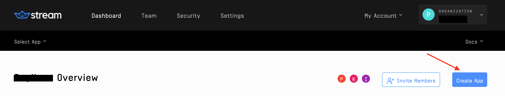

4. Give your app a name, and select 'development'.

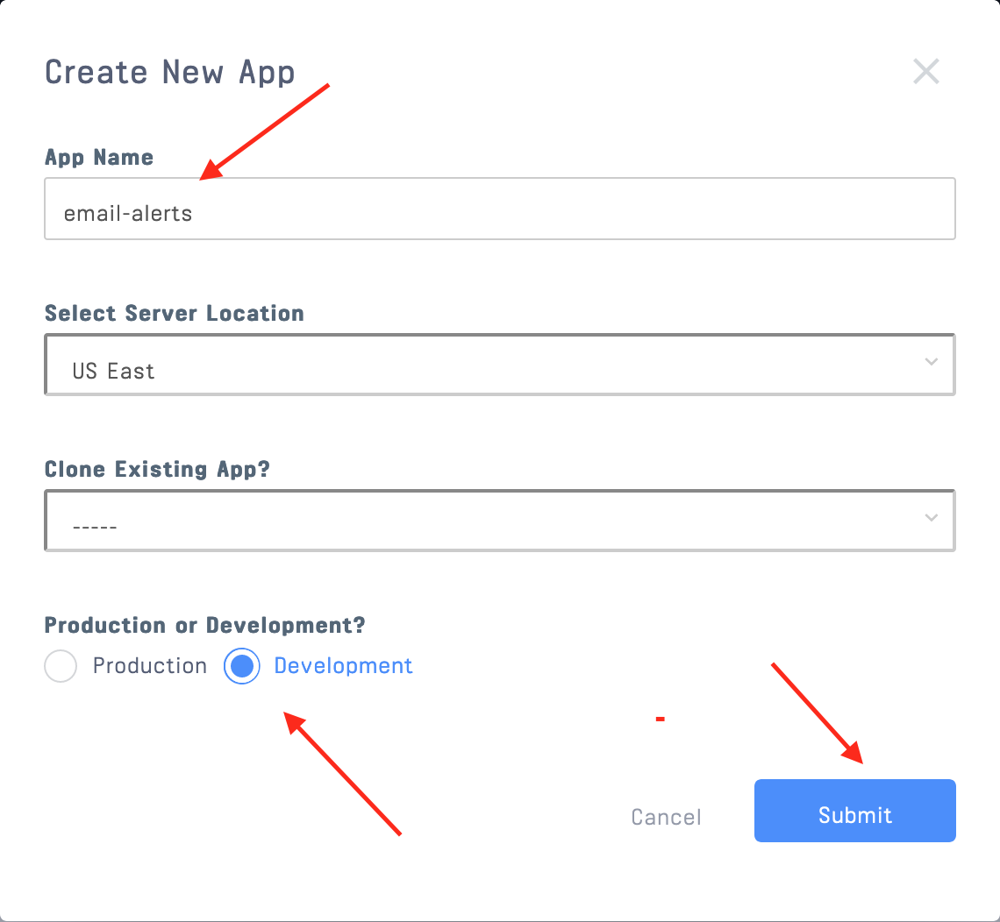

5. Your new app will now be in your dashboard. Copy your app's 'KEY', 'SECRET', and 'APP ID', and add them to the file named `.env.example` in the `backend` folder. Rename this file to just `.env`.

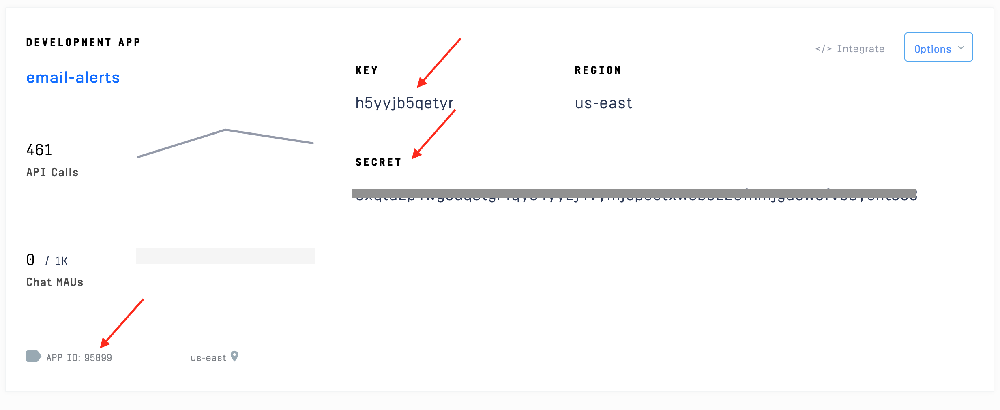

<!-- https://gist.github.com/isaidspaghetti/2dd238f5d87ee803ec2f9d86358ce14d -->

```terminal
//backend/.env.example
NODE_ENV=development
PORT=8080

STREAM_API_KEY='your stream API key here'
STREAM_API_SECRET='your stream secret here'
STREAM_APP_ID='your app id here'
```

Next, we need to create some Stream Feed Groups in our Dashboard.

### Creating Stream Feed Groups

> **Feed Groups:**
> Use [feed groups](https://getstream.io/docs/creating_feeds/?language=js) to organize the different types of feeds in your app.
> An app like Spotify might use feed groups like the following:
> 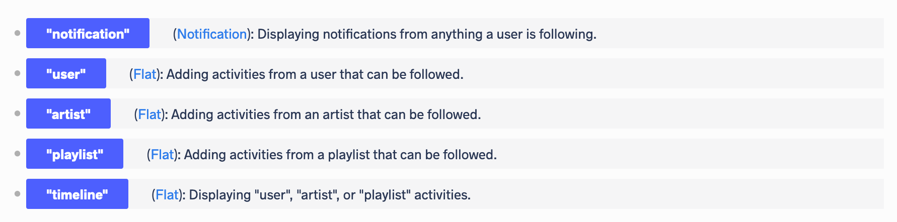

Each Stream Feed belongs to a Feed Group. We will create one feed group for _creating_ notifications called 'email_notifications', and another feed group for _consuming_ notifications called 'notification'.

> **Note:** This is just one way to architect a Stream app. Stream is incredibly flexible, so you can structure your app in whatever fashion fits your needs best.

To create a feed group:

1. Click on your app in the [Stream dashboard](https://getstream.io/dashboard).

2. Click the 'Add Feed Group' button on the right.

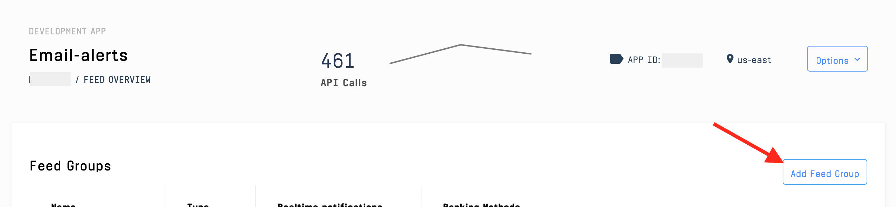

3. Name the feed group 'notification', select the type 'notification', click 'save'.

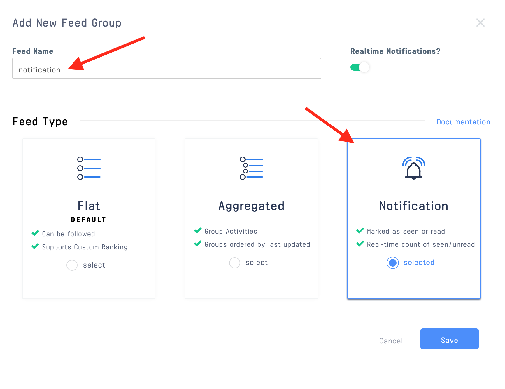

4. Create another feed group named 'email_notifications' with the type 'flat'. Click 'Save'.

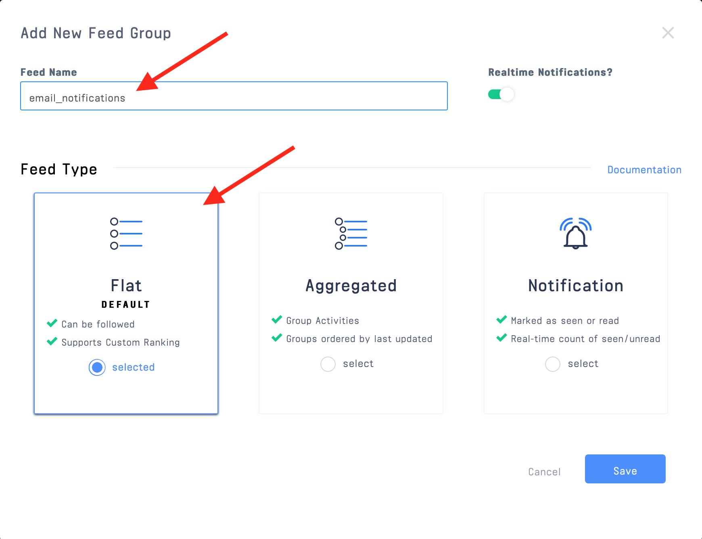

> **[Feed Group _Types_](https://getstream.io/docs/flat_feeds/?language=js)** have different behavior settings.
>
> - *Flat Type* feed groups are the only feeds that can be followed.
> - *Flat Type* feeds can also be used to consume activities from other feeds - in a 'timeline-like' manner.
> - *Aggregated Type* feeds are helpful for grouping similar 'activity' types (EG: "4 users liked your photo!").
> - *Notification Type* feeds are an extension of the Aggregated Type. They help you keep track of whether an activity is 'unseen' or has been 'seen'.
> - Get creative with your custom feed groups to customize Stream's feeds to your needs.

Now we're ready to flow through the app itself!

## Frontend Registration

Let's first register a frontend user and initiate a Stream client. We'll start with a React `useEffect()` to trigger registration when a user visits the app (at [http://localhost:3000](http://localhost:3000) if you're using the [Git Repo](https://github.com/isaidspaghetti/stream-email-notifications)).

<!-- https://gist.github.com/isaidspaghetti/d2e7980950a550b2c7e42bfe908e6ab0 -->

```jsx
//frontend/src/App.js:12
const [streamCredentials, setStreamCredentials] = useState(null);

useEffect(() => {
  async function register() {
    try {
      var response = await axios.get("http://localhost:8080/registration");

      setStreamCredentials({
        token: response.data.userToken,
        apiKey: response.data.streamApiKey,
        appId: response.data.appId,
      });
    } catch (e) {
      console.error(e, e.error);
    }
  }
  register();
}, []);
```

- The state variable, `streamCredentials` will store a `token`, `apiKey`, and `appId` (required to run a frontend instance of Stream).
- `axios` requests the `registration` endpoint in our app's backend, which will respond with these items.
- Notice the use of an empty array for the second argument `[]`. This ensures the `useEffect()` is only triggered once.

Now let's set up the backend and respond to this request.

> **Note:** The backend of this app was created using `npx express-generator --no-view`.

## Backend Registration

The following code snippet initializes a Stream app with the Stream API using our `.env` variables and the `.connect()` method.

<!-- https://gist.github.com/isaidspaghetti/bc4bef075433765c47589867f7bcccd5 -->

```javaScript
//backend/routes/index.js:8
require("dotenv").config();

const streamApiKey = process.env.STREAM_API_KEY;
const streamApiSecret = process.env.STREAM_API_SECRET;
const appId = process.env.STREAM_APP_ID;

const client = stream.connect(streamApiKey, streamApiSecret);
```

Now we can respond to the frontend registration request:

<!-- https://gist.github.com/isaidspaghetti/c58dba584f7591de795ab9c821b5e1bc -->

```javaScript
//backend/routes/index.js:16
router.get("/registration", async (req, res) => {
  try {
    await client.user("example-user").getOrCreate({
      name: "example-user",
    });

    await client.user("sendGrid").getOrCreate({
      name: "sendGrid",
    });

    const userFeed = client.feed("notification", "example-user");

    await userFeed.follow("email_notifications", "sendGrid");

    const userToken = client.createUserToken("example-user");

    res.status(200).json({
      userToken,
      streamApiKey,
      appId,
    });

    res.end();

  } catch (err) {
    console.error(err);
    res.status(500).json({ error: err.message });
  }
});
```

The snippet above creates two users: one to add notifications (`sendGrid`) and another to consume them (`example-user`).

Since this is a demo app, we used the `getOrCreate()` Stream method, but production apps should create users only once. Check the [docs](https://getstream.io/docs/users_introduction/?language=js) for other user creation and user fetch methods.

Next, we pointed to the 'notification' feed for the `example-user`, and had it `follow` the `sendGrid` user's 'email_notifications' feed.

> **Following Feeds:**
> One structural option is to have users that [follow and/or generate feeds](https://getstream.io/docs/creating_feeds/?language=js). We're using a structure where individual users can follow other users' feeds.

The `SendGrid` user will add notifications (activities) to the 'email_notifications' feed, and the `example-user`'s 'notification' feed will follow that feed.

> **Activities** are the items that make up feeds. Read [this doc](https://getstream.io/docs/adding_activities/?language=js) to learn more about activities.

Finally, we responded to the frontend with the required credentials.

That wraps it up for backend registration. Let's see what we do with the `token`, `apiKey`, and `appId` in the frontend...

## Render Stream using React

Remember that the frontend's `useEffect()` set the state variable `streamCredentials` to an array with the [`token`, `apiKey`, & `appId`] from the backend. We use a boolean based on `streamCredentials` to determine what to render on the page:

<!-- https://gist.github.com/isaidspaghetti/bbdda55debe0915e340de2927978126f -->

```jsx
//frontend/src/App.js:29
if (streamCredentials) {
  return (
    <div>
      <h2 className="app-title">Stream Custom Email Notifications</h2>
      <div className="container">
        <StreamApp
          className="stream-app"
          apiKey={streamCredentials.apiKey}
          token={streamCredentials.token}
          appId={streamCredentials.appId}
        >
          <NotificationDropdown FeedGroup="notification" Group={Notification} />
        </StreamApp>
      </div>
    </div>
  );
} else {
  return <h1>Retrieving token...</h1>;
}
```

This app uses Stream's [React Components library](https://www.npmjs.com/package/react-activity-feed). When using this library, the Stream App should be nested in the [`<StreamApp />` Component](https://getstream.github.io/react-activity-feed/#streamapp), which requires the `apiKey`, `token`, and `appId`. Because the `example-user` is tied to the `token` we generated, we do not need to pass in a `userId`.

### NotificationDropdown

Nested in the `<StreamApp />` Component is another built-in Stream Component called [`<notificationDropdown />`](https://getstream.github.io/react-activity-feed/#notificationdropdown). To use this component, pass in the name of the feed group you want to render into the `FeedGroup` prop. We will render the 'notification' feed group.

Next, we pass a component called `Notification` to the `Group` prop. This component will determine how the feed group's activities (notifications) will be rendered.

Before we dive into rendering activities, let's look at how they are made.

## Creating Notifications

Remember how our SendGrid Parse was sending email data to our backend? Let's review that endpoint now.

<!-- https://gist.github.com/isaidspaghetti/7bb70ca823c18fa09a9d1054c505cf5d -->

```javaScript
//backend/routes/index.js:44
const upload = multer();

router.post("/sendgrid-webhook-endpoint", upload.none(), async function (req, res) {
  try {
    let actor;
    let verb;
    let object;
    let body;

    if (req.body.text.includes("youtube")) {
      actor = "youtube";
      verb = "comment";
      object = req.body.text.match(
        /https:\/\/www\.youtube\.com\/attribution_link.*comments/gim
      );
      body = req.body.text
        .match(/\n.*\nReply/gim)
        .toString()
        .replace("Reply", "", /(\r\n |\n |\r)/gm, "");
    } else if (req.body.subject.includes("Twitter")) {
      actor = "twitter";
      verb = "message";
      object = req.body.text
        .match(/https.*>/i)
        .toString()
        .replace(">", "");
      body = req.body.text
        .match(/To:.*\n\n\n.*/gim)
        .toString()
        .replace(/To:.*\n\n\n/gim, "");
    } else {
      actor = "sendGrid";
      verb = "email";
      object = "link-to-your-mail-account";
      body = req.body.text;
    }

    const sendGrid = client.feed("email_notifications", "sendGrid");

    await sendGrid.addActivity({
      actor: actor,
      verb: verb,
      object: object,
      subject: req.body.subject,
      recipient: req.body.to,
      body: body,
      sender: req.body.from,
    });

    res.status(200).send();

  } catch (error) {
    console.log(error);
    res.status(500).json({ error: error.message });
  }
});
```

This endpoint is ultimately responsible for creating activities for each email received on the domain you specified. This is where you get to customize your app to filter out unwanted notifications, highlight others, etc. You could filter emails by email body keywords, specific senders, subjects, recipients, etc.--the options are endless.

Let's break down what we did for this app...

### Parse Webhook Emails

The SendGrid Inbound Parse Webhook `POST`s information about each email as 'multipart/form' data. Therefore, used the `upload.none()` method from the [`multer` library](https://www.npmjs.com/package/multer) to parse the data.

### Filtering Strategy

This app will center around YouTube comments, Twitter DMs (Direct Messages), and general emails. We configured our YouTube and Twitter accounts to send email notifications for these activities to email addresses on our domain.

### Filter Emails

The snippet above uses a boolean to decide which category each email falls into, and creates activities accordingly.

Per [JSON specs](https://activitystrea.ms/specs/json/1.0/), each activity should include the minimum properties of an `actor`, `verb`, and `object`.

Stream allows you to add unlimited custom properties to your activities. We included the `body`, `subject`, `recipient`, and `sender` properties for ours. We'll use these properties to dynamically render activities in the frontend.

The regex expressions are used to select what data we want from each Inbound Parse `POST`. Don't get hung up on deciphering these, they were created to specifically help match the content of standard YouTube and Twitter notification emails.

> We like using the [regexr](https://regexr.com/) app for testing our regex expressions.

### Add Activities To A Feed

Finally, we defined `sendGrid` as a variable pointing to the user `sendGrid`'s 'email_notifications' feed, then we added each activity using `addActivity()`. Remember to add a response to the webhook with a successful `200` status.

That does it for adding activities to feeds. Let's look at how we render them.

### Activity Grouping

Stream's notification-type feed groups are designed to aggregate activities, EG: "4 friends liked your post", or "You received 2 pokes!".

Activity groupings are fully customizable. For this app, we want to order our notifications by sender, EG: "You have 2 new YouTube Comments". Let's set this up in the Stream Dashboard.

1. In your [Stream App Dashboard](https://getstream.io/dashboard/organization), click on the 'notification' feed group.

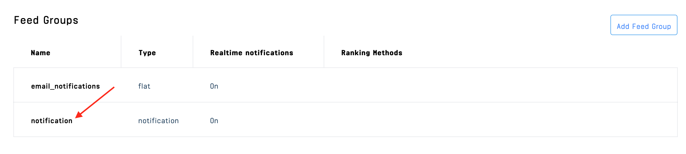

2. In the group settings you will see an area where you can use [Jinja 2 Template Syntax](https://jinja.palletsprojects.com/en/master/) to customize your groupings. Change this 'Aggregation Format' to `{{ actor }}_{{ time.strftime('%Y-%m-%d') }}`. This will make group activities by their `actor`, and sort groups with the most recent activity first.

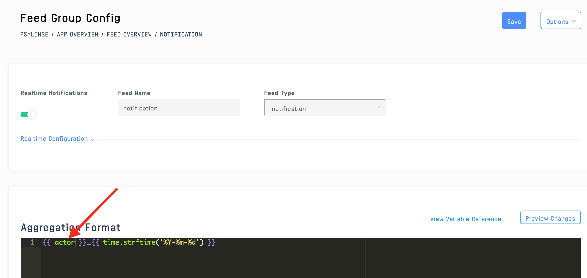

Learn more about grouping customization [here](https://getstream.io/docs/flat_feeds/?language=js).

### Custom Rendering

Remember, the `<NotificationDropdown />` Component passes each activity group to the `Group` prop. Stream has some built-in components you can use to render the groups, but we will now create a custom rendering component called `Notification`.

The snippet below uses booleans to decipher which type of activity we are dealing with: a YouTube `comment`, a Twitter `message`, or a general email.

Next, if there are multiple YouTube or Twitter activities, we will group them and render them differently, so we check the `activity_count` to see how many activities are in each group.

Finally, we will use the properties we added to each activity in the backend to render them as desired.

You can use this snippet as a template to customize your own rendering.

<!-- https://gist.github.com/isaidspaghetti/7bb70ca823c18fa09a9d1054c505cf5d -->

```html
//frontend/src/Notification.js
const Notification = (activity) => {
  if (activity.activityGroup.verb === "comment") {
    if (activity.activityGroup.activity_count <= 1) {
      return (
        <div className="notification">
          <div className="notification-header">
            
            <div className="youtube">
              <strong>New YouTube Comment</strong> from{" "}
              {activity.activityGroup.activities[0].from}{" "}
            </div>
          </div>
          <p className="notification-content youtube">
            {activity.activityGroup.activities[0].body}
          </p>
        </div>
      );
    } else {
      return (
        <div className="notification">
          <div className="notification-header">
            
            <div className="youtube">
              <strong>
                {activity.activityGroup.activity_count} New YouTube Comments{" "}
              </strong>
            </div>
          </div>
        </div>
      );
    }
  } else if (activity.activityGroup.verb === "message") {
    if (activity.activityGroup.activity_count <= 1) {
      return (
        <div className="notification">
          <div className="notification-header">
            
            <div className="twitter">
              <strong>New Twitter DM</strong>
            </div>
          </div>
          <p className="twitter">
            From {activity.activityGroup.activities[0].from}
          </p>
          <p className="notification-content twitter">
            {activity.activityGroup.activities[0].body}
          </p>
        </div>
      );
    } else {
      return (
        <div className="notification">
          <div className="notification-header">
            

            <div className="twitter">
              <strong>
                {activity.activityGroup.activity_count} New Twitter DMs
              </strong>
            </div>
          </div>
          <p className="notification-content twitter">
            {activity.activityGroup.activities.map((activity) => {
              return <div>{activity.from}, </div>;
            })}
          </p>
        </div>
      );
    }
  } else {
    return activity.activityGroup.activities.map((email) => {
      return (
        <div className="notification">
          <div className="notification-header">
            
            <div className="email">
              <strong>New Email</strong> From: {email.from}
              <br />
              To: {email.recipient}
            </div>
          </div>
          <p className="notification-content email">{email.body}</p>
        </div>
      );
    });
  }
};
```

### Next Steps

This demo app is now complete, but you can add more cool functionality like 'seen' and 'unseen' behaviors and rendering for each. Check out the [Stream Feed Docs](https://getstream.io/docs/?language=js), [Stream Feed React Docs](https://getstream.github.io/react-activity-feed/), and [Stream Feed Tutorials](https://getstream.io/docs/notification_system/?language=js) to continue customizing your app.

## Conclusion

That's it! You now have a fully functional email notification app with custom filtering, dynamic rendering, and live updates! For more content and tutorials, check out the [Stream Blog](https://getstream.io/blog/). Happy Coding!
